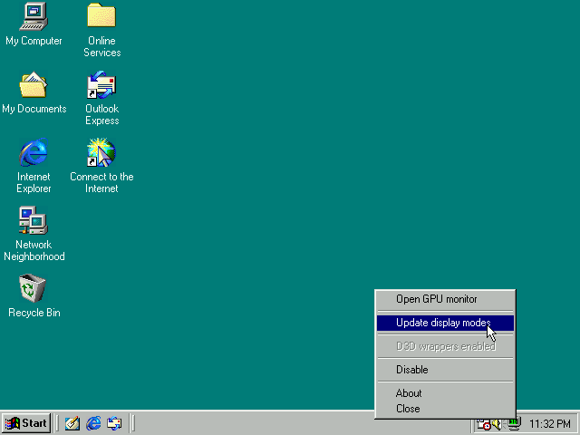
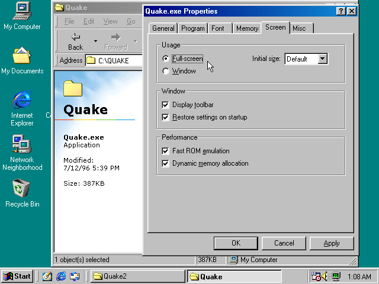

# VMDisp9x
Virtual Display driver for Windows 95/98/Me. Supported devices are:
- Bochs VBE Extensions (Bochs: VBE, VirtulBox: VboxVGA, QEMU: std-vga)
- VMWare SVGA-II (VMWare Workstation/Player, VirtulBox: VMSVGA, QEMU: vmware-svga)
- VBox SVGA (VirtulBox: VBoxSVGA)
- Any video adapter with VESA BIOS Extension 2.0/3.0

Supported and tested virtualization software are:
- ~~VirtualBox 6.0 (2D, software 3D)~~
- VirtualBox 6.1 (2D, hardware OpenGL 2.1 through DX9/OpenGL)
- VirtualBox 7.x (2D, hardware OpenGL 2.1 through DX9/OpenGL or 4.1 through DX11/Vulkan)
- VMWare Player 16 (2D, hardware OpenGL 2.1/3.3)
- VMWare Workstation 17 (2D, hardware OpenGL 2.1/4.3)
- QEMU 7.x, 8.0 (2D, software 3D)

2D driver is very generic works with any video adapter, 3D part required my Mesa port = https://github.com/JHRobotics/mesa9x. See its documentation for more info.

## Easy installation
This repository only contains the display driver, if you want user friendly installation, please use [SoftGPU](https://github.com/JHRobotics/softgpu) instead (this driver is part of SoftGPU project). There is also small [tutorial here](https://github.com/JHRobotics/vmdisp9x/issues/9#issuecomment-2452598883).

## Origin
Driver is based on [Michal Necasek's VirtualBox driver](http://www.os2museum.com/wp/windows-9x-video-minidriver-hd/). With my modifications:
- added VMWare SVGA and VirtualBox SVGA support
- added OpenGL ICD support (simple command that only returns the name of OpenGL implementation library)
- most calls converted to 32bit mini-VDD driver (faster and not limited by 64k segmentation)
- added access VMWare/VBox SVGA API to support real 3D acceleration from user space driver
- added API to access VRAM/FB directly
- added DirectDraw support
- added DirectX support
- added VESA BIOS support

QEMU support (`-vga std`) is from [Philip Kelley driver modification](https://github.com/phkelley/boxv9x)


## OpenGL support
OpenGL is supported by OpenGL ICD driver loading (you can use software only driver but also exists HW accelerated implementations). Currently supported ICD drivers are [Mesa9x](https://github.com/JHRobotics/mesa9x/) or my [qemu-3dfx fork](https://github.com/JHRobotics/qemu-3dfx).

## DirectDraw support
DirectDraw is supported, Ring-3 driver is in separated project [VMHal9x](https://github.com/JHRobotics/vmhal9x).


## Direct3D support
DirectDraw is now in development, most of D3D code is in VMHal9x, rasterization is done by Mesa9x. Current DDI is 8, this mean support up to DX9 programs and games.


## Glide support
Glide support has nothing to do with display driver. But when OpenGL is supported is possible to use [OpenGlide9X](ttps://github.com/JHRobotics/openglide9x) wrapper to translate Glide (2 and 3) calls to OpenGL.


## VirtualBox
VirtualBox is supported from version 6.1 (but 5.0 and 6.0 with some limitation works). More on [SoftGPU readme](https://github.com/JHRobotics/softgpu/blob/main/vbox.md#virtualbox-vm-setup-with-hw-acceleration).

## VMware Workstation and Player
VMware workstation is supported in current version (17.5.x). In theory, this driver can work from version 9.x, but I don't have enough resources to do complete testing of old closed non-free software. More information also on [SoftGPU readme](https://github.com/JHRobotics/softgpu/blob/main/vmware.md#vmware-workstation-setup-with-hw-acceleration).


## QEMU
QEMU is supported since **v1.2023.0.10**. Supported adapters are `-vga std` which using modified VBE driver (`qemumini.drv`) and `-vga vmware` where VMware driver now works but is limited to 32bpp colours only. I plan to support *VirGL* in future, but currently no 3D acceleration isn't available in vanilla QEMU (but HW acceleration is possible with [QEMU-3DFX](https://github.com/kjliew/qemu-3dfx).


## VESA BIOS extension

This driver (in theory) also works on any hardware or software device with VESA BIOS extension 2.0 or 3.0 support. This is almost every video card with PCI bus and its successors (AGP, PCI-E), with this is possible using this driver on real hardware, but there are few limitations:

- you cannot switch between DOS in window mode and fullscreen, DOS games starts from Windows works but sometimes need specify fullscreen mode on startup.
- only supported 2D acceleration is double buffering (will be also emulated if adapter cannot move framebuffer start position)
- 3D acceleration is fully software
- setting refresh rate is not supported yet
- screen modes (resolution and colour depth) isn't detected on installation and needs be enumerated by extra utility


### Driver choice

When you can choice between a native driver (for virtual or real video card), please choose the native driver, it'll be faster and stabler. VESA driver is usually good on situation where HW is too new to have Windows 9X drivers.

### Display modes

Display modes are wired in driver `*.inf`, but is possible to update screen modes (resolution and colour depth) by read them from display adapter. Simplest way, is click on monitor icon on right side of taskbar and chose "Update display modes".



Alternative is run this command:
```
cd C:\windows\system
vesamode /insert /24
```


### DOS in window

When you open command line application or run DOS program (like `command.com`) then lots of things will happen - at first system creates new V86 virtual machine (!) and map to its space BIOS (including Video BIOS) and run in it fresh instance of DOS. System also catches some important interrupts and I/O ports (but not at all). This is necessary to understand, because this is source of lots of strange things what can happen. When DOS boot runs `INT 10h` to set correct console mode (like on real boot), but system catches I/O ports, so your real screen don't switch to console mode. Old video card BIOSes counting with this behaviour, but newer not. Never BIOS will be confused and probably will reset the video card. To prevent this, VESA driver don't allow call mode set from window (`MOV AH,0h; INT 10h`, or `MOV AX,04F02h; INT 10h`), the drawbacks are, that full screen switch (Alt+Enter) not working correctly. Also DOS games usually cannot switch to MODE X, when they run from window.

For using graphical DOS programs and games, please run them in full screen mode:



When you have video card from Windows 9x era, you can try switch off this "mode set eating", by the setting this registry key:

```
REGEDIT4

[HKEY_LOCAL_MACHINE\Software\vmdisp9x\vesa]
"DosWindowSetMode"=dword:00000001

```

(and reboot computer)

To test that you Video BIOS can handle this, simply run (START -> run) `command.com` and when your screen will broke (you will see full black, or some random chars) this setting is not for you. (You can press Alt+Enter to switch DOS to fullscreen and again Alt+Enter to back to window = this probably can you return to right screen mode).

### Double buffering

Most VESA card support double buffering (e.g. seamless move frame buffer to different location in VRAM). But sometime (or for some applications) this don’t work correctly and [tearing](https://wiki.osdev.org/Double_Buffering#Tearing) is too high - mostly because application control buffer flipping, but due emulation of most drawing and timing function simply doesn't catch right time. For this situation you can force double buffer emulation by this registry key:

```
REGEDIT4

[HKEY_LOCAL_MACHINE\Software\vmdisp9x\vesa]
"HWDoubleBuffer"=dword:00000000

```

(Default value is 2)

Also note, that software double buffering can by very slow (because needs reading from video ram).


### Minimal configuration

Minimal configuration (for Windows 95 build) is Intel 486 with 16 MB ram + PCI S3 (Trio or Virge) with 4 MB VRAM. On this configuration isn't 3D available (for obvious reason). For 3D acceleration you need at last Pentium 3 CPU + 256 MB RAM. But software 3D acceleration is CPU heavy, so doesn't make any sense to run VMDisp9x on these configurations. Minimal usable configuration is around Intel Core 2 CPU with Intel 965 integrated GPU.

### DOSBox/DOSBox-X

Technically is possible to use VMdisp9x with DOSBox (with `machine=svga_s3trio` or `machine=svga_s3virge`). But it doesn't make much sense, performance will be very bad.


## Technical
`*.drv` = 16bit driver runs in 16-bit protected mode in RING 3 (!) but with access to I/O instructions 

`*.vxd` = 32bit driver runs in 32-bit protected mode in RING 0

`*.dll` = 32bit user library runs in 32-bit protected mode in RING 3

### Adapters

Default `*.inf` file is supporting these 4 adapters:

`[VBox]` Default adapter to VirtualBox (VBoxVGA) (until version 6.0 only one adapter) - using 16-bit `boxvmini.drv` driver. Device identification is `PCI\VEN_80EE&DEV_BEEF&SUBSYS_00000000`.

`[Qemu]` QEMUs `-vga std` (or `-device VGA`) device - using 16-bit `qemumini.drv` driver. Device identification is `PCI\VEN_1234&DEV_1111`.

`[VMSvga]` VMware adapter, VirtualBox VMSVGA and QEMU `-vga vmware`. Using 16-bit `vmwsmini.drv` driver and 32-bit `vmwsmini.vxd` driver. Device identification is `PCI\VEN_15AD&DEV_0405&SUBSYS_040515AD`.

`[VBoxSvga]` VirtualBox VBoxSVGA, using 16-bit `vmwsmini.drv` driver and 32-bit `vmwsmini.vxd` driver. Device identification is `PCI\VEN_80EE&DEV_BEEF&SUBSYS_040515AD`.

## Resolutions support
With default `*.inf` file, maximum resolution is 1920 x 1200. Maximum wired resolution is 5120 x 4096. For compatibility reasons maximum of VRAM is limited to 128 MB (If you set to adapter more, it'll report only first 128 MB).

However, it is possible increase the limit to 256 MB (Windows 9x maximum) by set this registry key: `HKLM\Software\VMWSVGA\VRAMLimit` to 256. (You can also decrease VRAM size by same way and have more free space is system area.)

### QXGA, WQHD, 4K and 5K
Resolutions sets larger than FullHD, are present in inf file, but needs to be *enabled* if you wish  would use them. They're split to 4 individual sections:

- `[VM.QXGA]` - QXGA, QWXGA and some others bit larger then FullHD
- `[VM.WQHD]` - 1440p resolutions set
- `[VM.UHD]` - 4K resolutions set
- `[VM.R5K]` - 5K resolutions set

To enable one of them just append section name to `AddReg=` parameter to corresponding adapter. For example, to add 4K to **VMware adapter** change:

```
[VMSvga]
CopyFiles=VMSvga.Copy,Dx.Copy,DX.CopyBackup,Voodoo.Copy
DelReg=VM.DelReg
AddReg=VMSvga.AddReg,VM.AddReg,DX.addReg
```

to:

```
[VMSvga]
CopyFiles=VMSvga.Copy,Dx.Copy,DX.CopyBackup,Voodoo.Copy
DelReg=VM.DelReg
AddReg=VMSvga.AddReg,VM.AddReg,DX.addReg,VM.UHD
```

### Custom resolutions

To add custom resolution just append line to `[VM.AddReg]` section with following format:

```
HKR,"MODES\{BPP}\{WIDTH},{HEIGHT}"
```

For example, adding 1366x768 for all colour modes can look like:

```
HKR,"MODES\8\1366,768"
HKR,"MODES\16\1366,768"
HKR,"MODES\24\1366,768"
HKR,"MODES\32\1366,768"
```

### VRAM size

Due limitation of virtual display card is usually required have enough memory for 2 display buffers, when 1st one is always in 32bpp. So, for 1024x768 16bpp you need about 4.5 MB VRAM (1024 x 768 x 4 + 1024 x 768 x 2). When HW acceleration is used, VRAM is not well utilized - textures and frame buffers must be in system RAM.


## Security
In 2D mode any application could read and write guest frame buffer and rest of video ram. If 3D is enabled and works (on hypervisor side) is possible by any application to write virtual GPU FIFO which could leads to read memory of different process (in same guest) or crash the guest. These risks are noted but needs to be mentioned that these old systems haven’t any or has only minimal security management. For example, Microsoft Windows 9x systems haven't file system rights, all process has mapped system memory (in last 1 GB of 32-bit memory space) and any user could run 16-bit application where have access to everything including I/O because of compatibility.

## Compilation from source
Install [Open Watcom 1.9](http://openwatcom.org/ftp/install/), then type
```
wmake
```
Edit `makefile` to enable addition logging and you can read original [readdev.txt](readdev.txt).

## Todo
- Complete recomended mini-VDD function in [minivdd.c](minivdd.c), stubs here and cites from original MSDN are in comments.
- ~Complete GPU10 functions (with synchronization with Mesa)~
- VirGL
- ~DDI~
- ~VESA support~

## External links
http://www.os2museum.com/wp/windows-9x-video-minidriver-hd/

https://wiki.osdev.org/Bochs_VBE_Extensions

https://wiki.osdev.org/VMWare_SVGA-II
